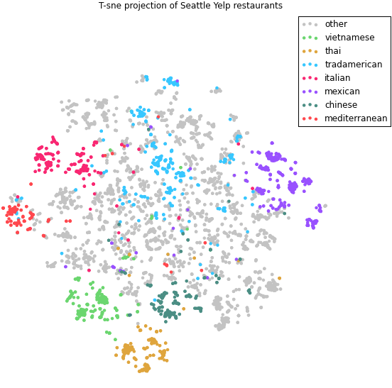
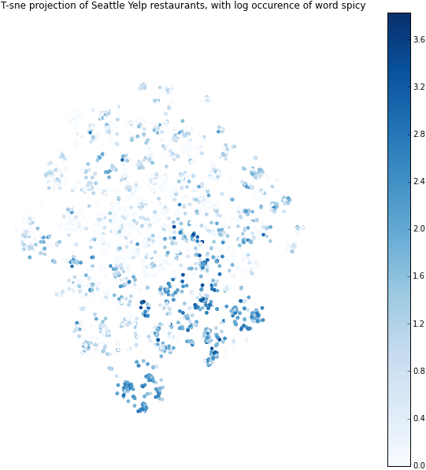

Object Language Model
=====================

A language model for documents and words. Train a 1 hidden layer feed forward neural network with document vectors and word vectors as inputs using multiclass and binary labels as targets using softmax and sigmoid activations. Both documents and words are trained through backprop. Words are shared among all documents, while document vectors live in their own embedding. The graph for this neural network is shown below:

Eucledian distances between documents are observed to possess fuzzy search properties over all the labels. Using T-SNE we can visualize these embeddings for restaurants in Seattle here:

and

## Usage

Here we initialize a model that uses the vectors for the words in a window and a special object vector corresponding to the document (restaurant) to perform classification. By gradient descent we can then update the word vectors and the object vectors so that the object vectors obtain some relation to the labels / targets provided to us (in this case the Yelp category, pricing, and rating labels).

We first prepare the dataset (nothing fancy here, just some iterator magic):
    
    from objectlm import ObjectLM, DatasetGenerator, CategoriesConverter

    file = gzip.open("saves/saved_texts.gz", 'r')
    texts, texts_data = pickle.load(file)
    file.close()

    categories = set()
    for el in texts_data:
        for c in el["categories"]:
            categories.add(c)

    catconvert = CategoriesConverter(categories)
    dataset_gen = DatasetGenerator(texts, texts_data, catconvert)

Then we construct the model:

    model = ObjectLM(
        vocabulary = lmsenti,
        object_vocabulary_size = len(texts),
        window = 10,
        bilinear_form = False,
        size = 20,
        object_size = 20,
        output_sigmoid_classes = catconvert.num_categories,
        output_sigmoid_labels = catconvert.index2category,
        output_classes=[5, 5], # "", "$", "$$",...,"$$$$", 5 price classes, and 5 rating classes
        output_labels = [["", "$", "$$", "$$$", "$$$$"], ["1", "2", "3", "4", "5"]]
    )

    min_alpha = float(0.001)
    max_alpha = float(0.0035)
    max_epoch = 9
    for epoch in range(0, max_epoch):
        alpha = max(min_alpha, max_alpha * (1. - (float(epoch) / float(max_epoch))))
        model._alpha = alpha
        objects, err = model.train(dataset_gen, workers = 8, chunksize = 24)
        print("Error = %.3f, alpha = %.3f" % (err, alpha))

We can then perform gradient descent on all the examples and minimize the classification error for each object. Running this for about 9 epochs works for a small dataset, and hopefully applies to the larger case here.

In this particular instance we find that looking at the eucledian distance between object vectors acts as a fuzzy search on all the attributes. It remains to be evaluated how much of the semantic information about the objects is contained in these. Furthermore, this model is not auto-regressive, thus there is no way to generalize to unlabeled data in the future. Nonetheless for document retrieval purposes this is effective.

It is important to note that there are hundreds of labels to predict, but only 20 dimensions for the object vector, thus this enforces specificity.

A Java implementation that can do prediction, but no training, can be [found here](https://github.com/JonathanRaiman/objectlm).

### Saving

Saving the model to for Matlab & Java:

The model's parameters can be saved to interact with Java as follows:

    model.save_model_to_java("saves/current_model")

Then from Java you can import this model as described [here](https://git.mers.csail.mit.edu/jraiman/yelplm/tree/master#load-language-model).

#### Additional Exports

Other files can be saved separately for exporting purposes

    dataset_gen.save("saves/objectlm_window_10_lm_20_objlm_20_4/__dataset__.gz")
    dataset_gen.save_ids("saves/objectlm_window_10_lm_20_objlm_20_4/__objects__.gz")
    model.save_model_parameters("saves/objectlm_window_10_lm_20_objlm_20_4")
    model.save_model_to_java("saves/objectlm_window_10_lm_20_objlm_20_4")
    catconvert.save_to_java("saves/objectlm_window_10_lm_20_objlm_20_4/__categories__.gz")
    model.save_vocabulary("saves/objectlm_window_10_lm_20_objlm_20_4")

### Loading a saved model:

To load a saved model, point it to a directory with the saved matrices:

    model.load_saved_weights("saves/objectlm_window_10_lm_20_objlm_20_4/")

### Querying the model

First we create normalized matrices:

    model.create_normalized_matrices()

Then we can perform searches on it using inner product distance (cosine):

    model.most_similar_word("science")

    [('request', 0.9545077085494995, 7163),
     ('hopefully', 0.9531156420707703, 38713),
     ('community', 0.9526830911636353, 6000),
     ('infused', 0.9511095285415649, 7513),
     ('yummy', 0.9509859085083008, 34636),
     ('fallen', 0.9509795904159546, 6096),
     ('feeling', 0.9508317708969116, 38029),
     ("'d", 0.9483151435852051, 26839),
     ('reading', 0.9478667974472046, 20754),
     ('work', 0.9475015997886658, 586)]

That's not brilliant, however the documents have captured "invariant" properties, use `most_similar_object` to repeat the operation above among documents.

### Dependencies

You will probably want the [xml_cleaner](https://github.com/JonathanRaiman/xml_cleaner) for cleaning up text if you want to easily process weirdly formatted inputs.
Easy to get:

    pip3 install xml_cleaner

### Creating trees

We can see infer new properties on restaurants given a tree from this compression model [here](http://nbviewer.ipython.org/github/JonathanRaiman/PythonObjectLM/blob/master/Covariance%20over%20a%20tree.ipynb).

And on a real dataset we can see [results here](http://nbviewer.ipython.org/github/JonathanRaiman/PythonObjectLM/blob/master/Covariance%20over%20Yelp%20Dataset.ipynb).
